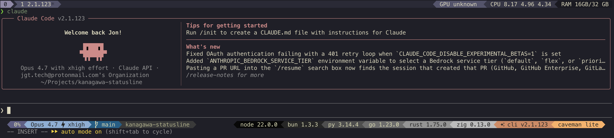

# kanagawa-statusline

A [Claude Code](https://docs.claude.com/en/docs/claude-code) statusline themed after [rebelot/kanagawa.nvim](https://github.com/rebelot/kanagawa.nvim). Lualine-inspired Powerline rendering with three Kanagawa variants, dynamic per-project runtime detection, and graceful degradation on narrow terminals.


*Kanagawa **Wave** variant — `kanagawa-statusline wave`. (Dragon and Lotus also available — see [docs/USAGE.md](docs/USAGE.md).)*

## Highlights

- **Three Kanagawa variants** — `wave`, `dragon`, `lotus`
- **Per-project runtime detection** — node, bun, python, go, rust, zig, odin
- **Dynamic gradient** — N visible language segments map to N evenly-spaced gray stops
- **Graceful degradation** — drops lower-priority segments when the line gets narrow
- **CLI variant switcher** — `kanagawa-statusline <wave|dragon|lotus|off>`
- **Update check + self-update** — daily background probe of the repo; renders an `update vX.Y.Z` segment when a new release lands. `kanagawa-statusline update` swaps in the latest version.

## Requirements

- bash 4+, `jq`, `python3`
- Nerd-font patched mono font + 256-color terminal

## Install

```bash
curl -fsSL https://raw.githubusercontent.com/securacore/kanagawa-statusline/main/install.sh | bash
```

The installer drops the script into `~/.claude/`, the CLI into `~/.local/bin/`, and merges a `statusLine` block into `~/.claude/settings.json`.

> [!TIP]
> Press Enter at the Claude Code prompt after install to refresh the statusline immediately.

## Quick start

```bash
kanagawa-statusline wave        # cool night (default)
kanagawa-statusline dragon      # warm earthy night
kanagawa-statusline lotus       # light theme
kanagawa-statusline off         # disable styling
kanagawa-statusline status      # show current variant + installed version
kanagawa-statusline version     # print installed version
kanagawa-statusline check       # check for a new release (synchronous)
kanagawa-statusline update      # self-update statusline + CLI to latest
kanagawa-statusline uninstall   # remove all installed files
```

## Documentation

- [docs/USAGE.md](docs/USAGE.md) — CLI commands, config file, env vars, variant gallery
- [docs/INTERNALS.md](docs/INTERNALS.md) — architecture, palette knobs, customization

## Optional dependencies

- [JuliusBrussee/caveman](https://github.com/JuliusBrussee/caveman) — writes the `~/.claude/.caveman-active` flag file consumed by the caveman badge segment. Statusline reads it directly so the badge always shows the current level (e.g. `caveman full`); segment is silently skipped if absent.

## Maintainers

Releases are driven by a `Justfile`:

```bash
just release          # +1 patch (default)
just release patch    # +1 patch
just release minor    # +1 minor, reset patch
just release major    # +1 major, reset minor + patch
just release-dry      # preview the bump (accepts the same levels)
just lint             # shellcheck + bash -n
```

Each `just release <level>` bumps `VERSION` and the embedded `KANAGAWA_STATUSLINE_VERSION` constant in lockstep, commits `Release vX.Y.Z`, tags `vX.Y.Z`, and pushes the branch + tag. The tag push fires `.github/workflows/release.yml`, which validates the three-way version sync (tag ↔ `VERSION` ↔ constant), lints, and publishes a GitHub Release with assets attached.

## License

[MIT](LICENSE)
