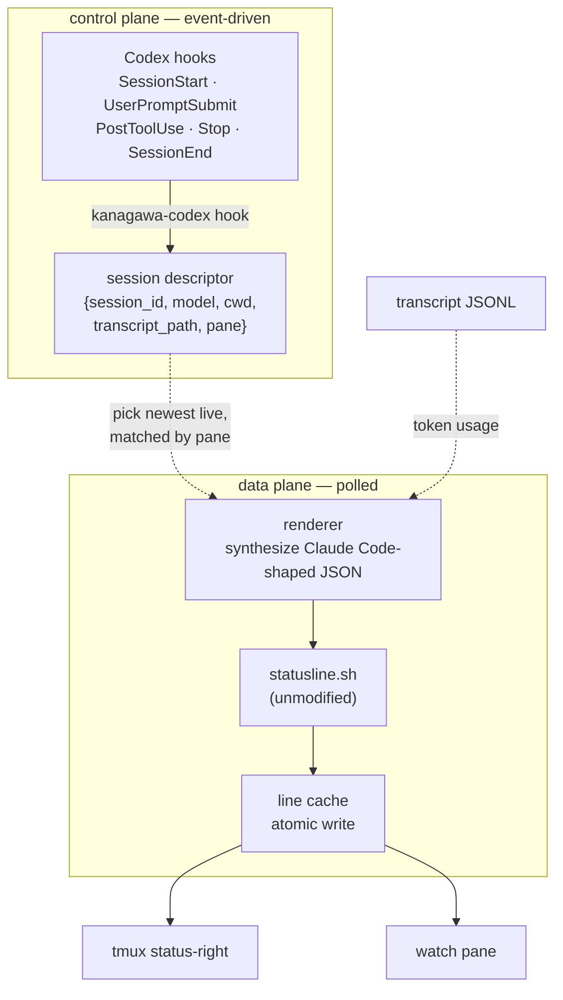

# Codex

The same statusline, rendered for [OpenAI Codex](https://developers.openai.com/codex).

## Why it works differently

Claude Code exposes `statusLine.command`: it spawns a script on every render and hands it the whole session as JSON on stdin. That is a **pull** model, and `statusline.sh` is written to match it — a pure function from JSON to one ANSI line.

Codex has no equivalent. Its `tui.status_line` accepts an ordered array of built-in item ids that Codex draws itself:

```
Model:  ModelName · ModelWithReasoning · Reasoning
Git:    GitBranch · PullRequestNumber · BranchChanges
Usage:  ContextUsed · ContextRemaining · UsedTokens · FiveHourLimit · WeeklyLimit
System: Permissions · ApprovalMode · CodexVersion · SessionId
```

There is no way to put an external renderer's output in that footer. The upstream request is [openai/codex#17827](https://github.com/openai/codex/issues/17827), open since 2026-04-14 ([#20244](https://github.com/openai/codex/issues/20244) was closed as a duplicate).

So the line renders **beside** Codex's TUI rather than inside it, onto a surface Codex does not own: tmux's status bar, or a dedicated one-line pane.

## Architecture

Codex does offer `hooks`, which is a **push** model: an external command invoked at discrete lifecycle moments with JSON on stdin. That is the dual of what the renderer wants, and bridging the two is what `kanagawa-codex` does.



**The split is the point.** Hooks answer *which session is live and where its transcript is*, which only they know reliably. The renderer answers *what does it look like right now*, on its own cadence.

Driving renders off hook cadence alone would look correct and behave badly: Codex fires at turn boundaries, so between the start and end of a long tool call nothing arrives, and the line would freeze during exactly the stretch where you most want to watch context burn. Polling decouples freshness from event delivery, and hooks still push an eager refresh so turn boundaries land instantly.

Finding the newest rollout under `~/.codex/sessions` by mtime would drop the hook dependency entirely, and guesses wrong the moment two Codex sessions run at once. Hooks cost one config block and are authoritative.

## Setup

```bash
kanagawa-codex init --tmux    # writes ~/.codex/hooks.json, prints the tmux snippet
kanagawa-codex doctor         # verify the wiring end to end
```

`init` writes hook entries for `SessionStart`, `UserPromptSubmit`, `PostToolUse`, `Stop` and `SessionEnd`, all `async: true` so Codex is never delayed waiting on a render. An existing `hooks.json` that does not mention `kanagawa-codex` is never rewritten; the snippet is printed for you to merge.

### Surface: tmux status bar

```tmux
set -g status-interval 2
set -g status-right '#(kanagawa-codex line --pane #{pane_id})'
set -g status-right-length 200
```

The `--pane` argument is what makes this work with more than one Codex session. tmux exports `TMUX_PANE` into the processes it spawns, Codex's hook subprocesses inherit it, and each descriptor records it. Two Codex sessions in two panes each draw their own line instead of fighting over one.

### Surface: dedicated pane

```bash
tmux split-window -l 1 'kanagawa-codex watch'
```

No tmux at all is possible with `watch` in any spare terminal, though nothing then binds it to a particular Codex session beyond "the most recent one".

## What the segments become

| Segment | Claude Code | Codex |
|---|---|---|
| ctx % | `context_window.used_percentage` | parsed from the rollout transcript, **omitted when unknown** |
| model | `model.display_name` | hook `model` slug, mapped to a display name |
| effort | `effort.level` | `model_reasoning_effort` from `config.toml` |
| cwd | `workspace.project_dir` | hook `cwd` |
| branch / dirty | derived from cwd | unchanged |
| langs, gradient | derived from cwd | unchanged |
| logos anchor | derived from cwd | unchanged |
| style | `output_style.name` | `approval_policy/sandbox_mode`, abbreviated |
| cli version | `version` | `codex --version` |
| caveman | flag file | never — see below |

Everything derived from `cwd` is harness-independent and needs no mapping at all. That is most of the line.

**Style slot.** Codex's approval posture is the natural occupant: it is what you want to see before you stop watching a turn. It is abbreviated (`on-request/workspace-write` → `on-req/ws`) because the renderer never drops the style segment, so its width is spent at every terminal size. The raw pair is 26 cells and would overrun a narrow surface with no drop path to recover.

**Caveman.** The badge is a Claude Code plugin's flag file. Under Codex the adapter points `CLAUDE_CONFIG_DIR` at an empty directory, so both the badge and the `settings.json` effort fallback go inert. A flag left over from a Claude Code session would otherwise render on a Codex line and claim something untrue about it.

## Context percentage: the honest caveat

**Codex hook payloads carry no token or context figures.** The documented fields are `session_id`, `cwd`, `hook_event_name`, `model` and `transcript_path`, plus `turn_id` on turn-scoped events. The only route to a percentage is aggregating usage records out of the rollout JSONL, whose format is undocumented and unpinned across Codex versions.

Two consequences:

1. **The parser validates hard and returns nothing on a mismatch.** An absent figure makes the ctx segment skip entirely rather than render `0%` or a stale number. Confidently wrong is the one outcome worth engineering against, so the failure mode is a missing segment.

2. **The context window size is not guessed.** Pin it explicitly:

   ```bash
   export KANAGAWA_CODEX_CTX_WINDOW=272000
   ```

   or in the shared config file:

   ```
   CODEX_CTX_WINDOW=272000
   ```

   Without it the segment stays hidden. A wrong denominator produces a confidently wrong percentage, which is worse than no segment.

`kanagawa-codex doctor` reports which half is missing when the segment does not appear.

## One config, both harnesses

`kanagawa-codex` reads the same `$XDG_CONFIG_HOME/kanagawa-statusline/config` the Claude Code statusline does, so `kanagawa-statusline dragon` re-themes both. There is no separate Codex variant setting by design: the palette is a property of your terminal, not of which agent you happen to be running.

## Commands

```bash
kanagawa-codex init [--tmux]      wire hooks; --tmux prints the status-right snippet
kanagawa-codex line [--pane ID]   cached line, re-rendered when stale (tmux calls this)
kanagawa-codex render [--pane ID] [--width N]   force one render to stdout
kanagawa-codex watch [-n SECS]    redraw loop for a dedicated pane
kanagawa-codex doctor             diagnose the wiring
kanagawa-codex uninstall [-y]     remove hooks + state
```

## Env

| Variable | Default | Purpose |
|---|---|---|
| `KANAGAWA_CODEX_CTX_WINDOW` | unset | context window size; without it the ctx segment is omitted |
| `KANAGAWA_CODEX_WIDTH` | auto | force surface width |
| `KANAGAWA_CODEX_CHROME` | `0` | margin subtracted from width (Claude Code's TUI uses `4`) |
| `KANAGAWA_CODEX_RENDER_TTL` | `2` | seconds a rendered line is served from cache |
| `KANAGAWA_CODEX_SESSION_TTL` | `28800` | descriptor lifetime; guards against a SIGKILLed Codex pinning the line |
| `KANAGAWA_CODEX_STATE_DIR` | `$XDG_STATE_HOME/kanagawa-codex` | where descriptors and rendered lines live |
| `KANAGAWA_STATUSLINE_SH` | auto | renderer location override |
| `CODEX_HOME` | `~/.codex` | Codex config directory |

## Troubleshooting

Run `kanagawa-codex doctor` first. It distinguishes the three states that otherwise look identical from the outside:

| Doctor says | Meaning |
|---|---|
| `hook has NEVER fired` | Codex is not invoking the hook. Check `jq '.hooks' ~/.codex/hooks.json` and that `[features] hooks` is not `false`. |
| `hook last fired: Nm ago` but no live session | The hook ran and died partway. The lines beneath name the cause. |
| `could not find jq in Codex's PATH` | Codex spawned the hook with a PATH that omits your package manager's prefix. |

### The foreign-environment constraint

Hooks run in an environment Codex hands them; the renderer runs in yours. Anything the two disagree about splits the control plane from the data plane, and the symptom is always the same and always misleading: everything reports as wired, both halves work perfectly when tested by hand, and no session is ever recorded.

Two concrete instances, both fixed in 0.0.17 and both worth knowing if you extend this:

- **State location.** It is anchored to `HOME` rather than `TMPDIR` or `XDG_RUNTIME_DIR`. Those are routinely absent or different in a spawned child, so descriptors were being written to `/tmp/kanagawa-codex-$UID` while the renderer looked under the shell's `TMPDIR`. Durability is a side benefit; **agreement across the boundary is the requirement**.
- **Tool discovery.** The hook extends `PATH` with the usual package-manager prefixes, but only when `jq` is genuinely missing, so a working environment is left alone.

The breadcrumb at `$STATE_DIR/last-hook` records the environment of the most recent hook invocation. It is written before anything that can fail, which is what makes a foreign-environment failure legible from your shell rather than invisible.

## Renderer changes this required

Two, both small and both additive:

- **`KANAGAWA_COLS`** now wins over `stty`/`$COLUMNS`/`tput` when set. A caller drawing into a surface that is not its own terminal knows the target width; discovery must not override it.
- **`context_window.used_percentage` defaults to empty, not `0`.** Claude Code always sends the field, so an absent value now means a genuinely unknown context rather than a fresh one, and the segment skips instead of asserting `0%`.
