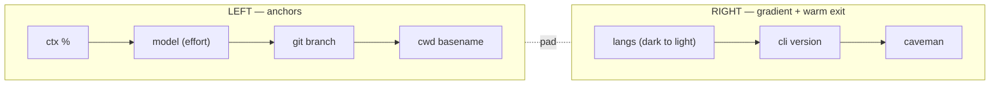
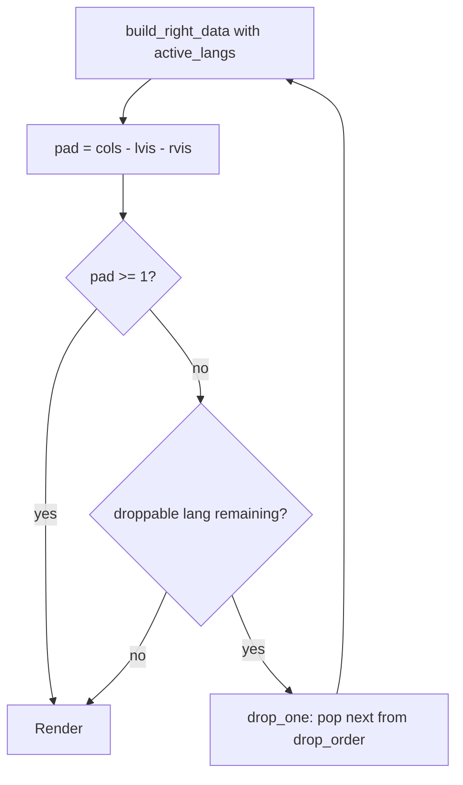

# Internals

## Layout



- **Protrude transition** — the boundary between ctx % and model uses a left-pointing Powerline arrow (instead of the standard right-pointing one), making the model bg appear to push leftward into ctx. Visually anchors the left edge.
- **Cap glyphs** — leading left cap on the ctx anchor, trailing right cap after caveman. Both colored to match the adjacent segment.

## Dynamic gradient

The right cluster's lang segments don't have hardcoded colors. `build_right_data()` recomputes per-segment grays each render based on how many lang segments are currently active (after degradation):

```
N visible langs  →  N evenly-spaced stops between GRAD_MIN and GRAD_MAX
```

So 2 langs span the full gradient just like 7 langs would, only with bigger gaps. Defaults: `GRAD_MIN=232` (sumiInk0), `GRAD_MAX=250` (near fujiWhite).

The fg picks darker text for lighter backgrounds via a threshold check.

## Graceful degradation

When the right cluster overruns the line, language segments are dropped one at a time until content fits.



```
drop_order=(odin zig rust go node bun py)
```

Cli, caveman, and style segments are never dropped (kept off the order list).

## Right-edge alignment

True terminal width comes from `stty size </dev/tty` (works inside Claude Code's spawned subshell where `$COLUMNS` is unset). A small chrome buffer (`cols - $KANAGAWA_CHROME`, default `4` — covers Claude Code's left+right TUI margins). Tunable per-terminal if your renderer is different.

Visible widths use a python helper that respects East Asian Width *and* maps Private Use Area glyphs (nerd-font icons) to `$KANAGAWA_PUA_WIDTH` cells (default `1`, suits Mono nerd-font variants). Set `KANAGAWA_PUA_WIDTH=2` if your font renders icons double-wide.

> [!NOTE]
> Defaults are calibrated for Mono nerd-font variants in Ghostty/iTerm2/etc. If alignment is off, tune `KANAGAWA_CHROME` (TUI padding) and `KANAGAWA_PUA_WIDTH` (glyph width) until the right cluster sits flush against the right edge.

## Variant palettes

Each Kanagawa variant defines its own color tokens via `apply_palette()`. Hex values mapped to nearest ANSI 256:

| token       | wave              | dragon              | lotus              |
|-------------|-------------------|---------------------|--------------------|
| ctx anchor  | 60 (deep violet)  | 96 (dragonViolet)   | 60 (lotusViolet4)  |
| model       | 110 (crystalBlue) | 109 (dragonBlue2)   | 24 (lotusBlue4)    |
| branch      | 24 (waveBlue2)    | 66 (dragonAqua-ish) | 152 (lotusBlue3)   |
| cwd         | 237 (sumiInk5)    | 235 (dragonBlack4)  | 187 (lotusWhite)   |
| GRAD_MIN    | 232               | 234                 | 250                |
| GRAD_MAX    | 250               | 247                 | 255                |
| style       | 179 (boatYellow2) | 144 (dragonYellow)  | 178 (lotusYellow3) |
| cli         | 173 (muted orange)| 180 (dragonOrange2) | 208 (lotusOrange2) |
| caveman     | 215 (surimiOrange)| 173 (dragonOrange)  | 166 (lotusOrange)  |

## Customization knobs

All tunables sit near the top of `statusline.sh`.

| Knob                     | Effect                                                                         |
|--------------------------|--------------------------------------------------------------------------------|
| `KANAGAWA_VARIANT`       | env override — wave / dragon / lotus / off                                     |
| `apply_palette()` cases  | Per-variant color tokens (CTX_BG, A_BG, B_BG, C_BG, GRAD_MIN/MAX, Y/Z/X)       |
| `drop_order`             | Lang priority for graceful degradation (first dropped first)                   |
| `KANAGAWA_CHROME`        | Chrome buffer for right-edge alignment (default `4`)                           |
| `KANAGAWA_PUA_WIDTH`     | Cell width for nerd-font PUA glyphs (default `1`; set `2` for non-Mono fonts)  |
| `STATUSLINE_DEMO=1`      | Env flag — preview all 7 lang segments with placeholder versions               |

## JSON fields consumed

The script reads these fields from the JSON Claude Code pipes via stdin:

- `model.display_name`, `effort.level` — left model segment
- `workspace.project_dir`, `workspace.current_dir`, `cwd` — paths
- `version` — cli version segment
- `output_style.name` — style segment (rendered when not `default`)
- `context_window.used_percentage` — ctx anchor

Schema reference: [Claude Code statusline docs](https://docs.claude.com/en/docs/claude-code/statusline).

## Caching

Per-project runtime versions (node/bun/py/...) are cached for 5 minutes in `$TMPDIR/cc-statusline-rt-<hash>`. The cache key is an md5 of the project path. Subsequent renders within the TTL skip the runtime lookups.
