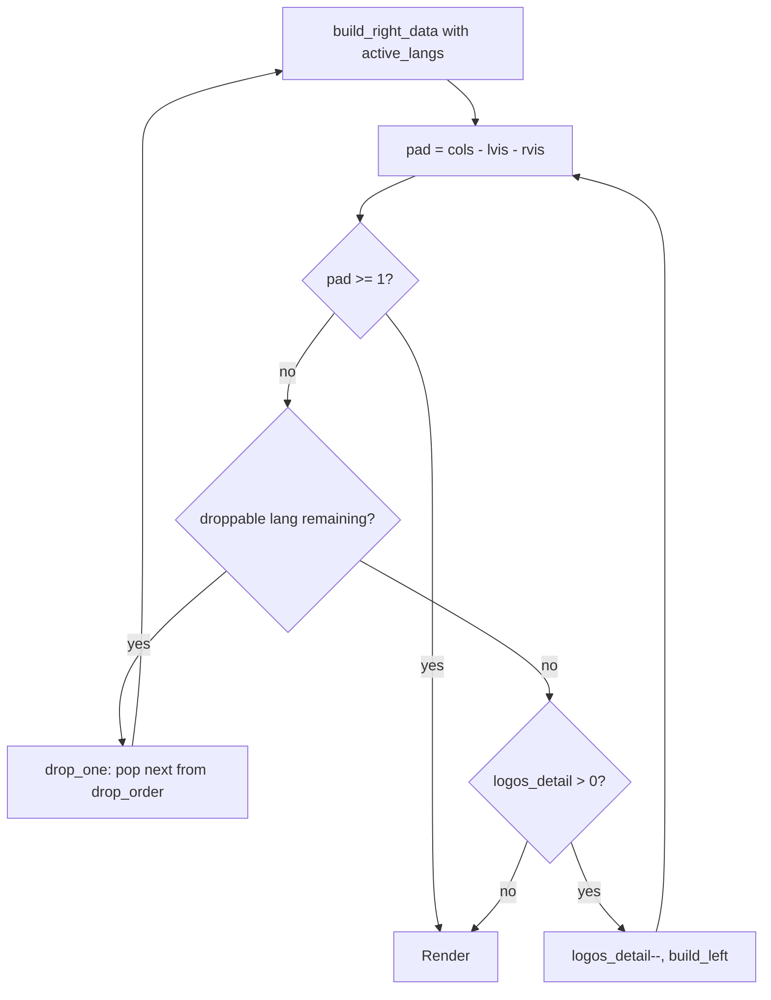
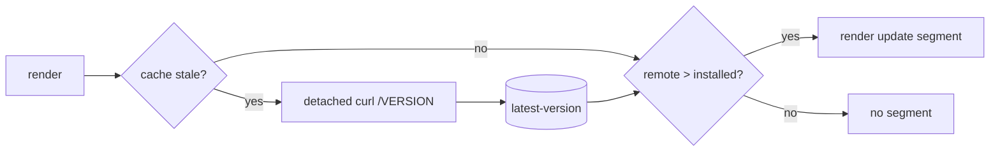

# Internals

## Layout

```mermaid
flowchart LR
  subgraph LEFT["LEFT — anchors"]
    direction LR
    ctx["ctx % 󰍛 size"] --> model["model (effort)"] --> cwd["cwd +N !N ?N"] --> branch[" branch ↑N ↓N"] --> logos["◈ feature (d/t) › ticket"]
  end
  subgraph RIGHT["RIGHT — gradient + warm exit"]
    direction LR
    langs["langs (dark to light)"] --> style["style"] --> cli["cli version"] --> caveman["caveman"] --> update["update vX.Y.Z"]
  end
  LEFT -.pad.- RIGHT
```

- **Protrude transition** — the boundary between ctx % and model uses a left-pointing Powerline arrow (instead of the standard right-pointing one), making the model bg appear to push leftward into ctx. Visually anchors the left edge.
- **Cap glyphs** — leading left cap on the ctx anchor, trailing right cap after caveman. Both colored to match the adjacent segment.
- **Git change breakdown** — when the project is a git repo with dirty state, the cwd segment appends p10k-style counts: `+N` staged (index), `!N` modified (worktree), `?N` untracked. Each token rendered only when nonzero. Single `git status --porcelain` pass parses XY columns. Omitted on clean repos and non-git paths.
- **Upstream divergence** — when the branch has an upstream, the branch segment appends `↑N` (ahead) and/or `↓N` (behind), via `git rev-list --left-right --count @{upstream}...HEAD`. Reflects state of the last `git fetch` only — remote commits pushed since then will not show as "behind" until the user fetches. Render hooks deliberately do not auto-fetch.

- **Logos anchor** — where work stands in the project's own plan, seated after branch because git says where you are in the history and this says where you are in the plan. Three positions, all stated rather than implied: `feature › ticket` while a ticket is building, `feature › none` between tickets, and nothing at all when no feature is active. Plurality resolves to a count and never to a pick (`N building` across features, `N active` when several features are open), because the state root does not know which one is yours. A ticket never renders without its feature: ticket slugs name the change they make rather than the arc they serve, so a slug alone orients nobody.

  `between` fills the ticket's own slot with `none` rather than closing the gap. That is load-bearing, not cosmetic: a bare feature is already what the segment degrades to under width, so without a marker in the slot a feature between tickets and a feature whose ticket was truncated away render identically.

  **Progress** rides the anchor wherever one feature is named: `(2/3)` counts that feature's validated tickets against all of them. The bar is `validated` alone, because that is what the roadmap already treats as closed (`roadmap.go:285-290` advances past exactly `FeatureDone` and `TicketValidated`); counting `landed` would put the segment and the roadmap in disagreement about the same tickets. It is absent on the plural forms, where a count against several features answers nothing, and absent for a feature with no tickets, since `0/0` reads as stalled rather than unplanned.

  **Adoption mode** rides the glyph rather than a field of its own: `◈` when the state root is committed inside the repository, `◇` when it lives outside under the installer's roof (with the whole segment tinted to the palette's aqua), and `◌` when the read did not say.

  Unknown is a glyph rather than a fallback to project. Defaulting would assert a mode on no evidence, and the case is reachable without anything being broken: a logos build predating the `mode` field, a cache written before it existed, or a value the whitelist does not recognise because a later logos added one. `U+25CC` is the standard placeholder ring, which is exactly the claim.

  Unknown renders at **full weight**, matching project rather than dimming. What is unknown is the mode; the feature, ticket, and progress beside it are all known, and tinting the whole segment on one unknown attribute would hide what we have to mark what we do not. Only the glyph carries the uncertainty. `DX_FG` remains a separate per-variant token so unknown can be escalated to its own colour later without restructuring the selection. A slot could not satisfy both of mode's properties at once — it is nearly static, which argues for shedding it early, and it is the one fact you should never have to guess at, which argues for keeping it last. Carried by the icon it costs no columns and survives to the final level for free.

  Sourced from `logos status`, which answers all three positions in one read and is silent with exit 0 in a project that never adopted logos, so the segment simply does not appear elsewhere. Never called on the render path — a background refresh writes a per-project cache under `$XDG_CACHE_HOME/kanagawa-statusline/`, lock-guarded the same way the update probe is. The TTL is short (`KANAGAWA_LOGOS_TTL`, default 20s) and deliberately time-based rather than keyed on HEAD: the anchor is a function of ticket state files, not of commits, and a ticket transitions long before anything is committed.

## Dynamic gradient

The right cluster's lang segments don't have hardcoded colors. `build_right_data()` recomputes per-segment grays each render based on how many lang segments are currently active (after degradation):

```
N visible langs  →  N evenly-spaced stops between GRAD_MIN and GRAD_MAX
```

So 2 langs span the full gradient just like 7 langs would, only with bigger gaps. Defaults: `GRAD_MIN=232` (sumiInk0), `GRAD_MAX=250` (near fujiWhite).

The fg picks darker text for lighter backgrounds via a threshold check.

## Graceful degradation

When the line overruns, the right cluster sheds first: language segments are dropped one at a time until content fits. Only once no lang is left does the left cluster yield, and only the logos anchor does — first its ticket, then the whole segment. Ctx, model, cwd, and branch are priority anchors and never drop.


```mermaid
flowchart TD
  build[build_right_data with active_langs] --> measure["pad = cols - lvis - rvis"]
  measure --> check{"pad >= 1?"}
  check -->|yes| render[Render]
  check -->|no| any{"droppable lang remaining?"}
  any -->|yes| drop[drop_one: pop next from drop_order]
  drop --> build
  any -->|no| lg{"logos_detail > 0?"}
  lg -->|yes| shed["logos_detail--, build_left"]
  shed --> measure
  lg -->|no| render
```

```
drop_order=(odin zig rust go node bun py)
```

Cli, caveman, and style segments are never dropped (kept off the order list).

```
4  ◈ feature (2/3) › ticket    everything
3  ◈ feature › ticket          count shed
2  ◈ feature                   ticket shed
1  ◈                           feature shed: still says logos is here, and in which mode
0  (nothing)
```

The ladder sheds by how much each field still means alone, least self-sufficient first. The count refines an answer rather than giving one, so losing it costs precision and not orientation. A ticket slug is a delta stated relative to its feature and means nothing by itself, while a feature is a complete referent that stands alone — which is why the ticket goes first even though it is the faster-changing of the two. The glyph outlives both because mode is true whether or not any work is happening. Level 0 exists because the line does not determine usability, so shedding the segment entirely is acceptable once nothing useful fits.

## Right-edge alignment

True terminal width comes from `stty size </dev/tty` (works inside Claude Code's spawned subshell where `$COLUMNS` is unset). A small chrome buffer (`cols - $KANAGAWA_CHROME`, default `4` — covers Claude Code's left+right TUI margins). Tunable per-terminal if your renderer is different.

Visible widths use a python helper that respects East Asian Width *and* maps Private Use Area glyphs (nerd-font icons) to `$KANAGAWA_PUA_WIDTH` cells (default `1`, suits Mono nerd-font variants). Set `KANAGAWA_PUA_WIDTH=2` if your font renders icons double-wide.

> [!NOTE]
> Defaults are calibrated for Mono nerd-font variants in Ghostty/iTerm2/etc. If alignment is off, tune `KANAGAWA_CHROME` (TUI padding) and `KANAGAWA_PUA_WIDTH` (glyph width) until the right cluster sits flush against the right edge.

## Variant palettes

Each Kanagawa variant defines its own color tokens via `apply_palette()`. Hex values mapped to nearest ANSI 256:

| token       | wave              | dragon              | lotus              |
|-------------|-------------------|---------------------|--------------------|
| ctx anchor  | 60 (deep violet)  | 96 (dragonViolet)   | 60 (lotusViolet4)  |
| model       | 110 (crystalBlue) | 109 (dragonBlue2)   | 24 (lotusBlue4)    |
| cwd         | 24 (waveBlue2)    | 66 (dragonAqua-ish) | 152 (lotusBlue3)   |
| branch      | 237 (sumiInk5)    | 235 (dragonBlack4)  | 187 (lotusWhite)   |
| logos, project | 235/179 (boatYellow2) | 234/180 (dragonOrange2) | 180/234 (muted tan) |
| logos, user | 235/109 (waveAqua2) | 234/109 (dragonAqua) | 180/66 (lotusAqua) |
| logos, unknown | 235/179 (as project) | 234/180 (as project) | 180/234 (as project) |
| GRAD_MIN    | 232               | 234                 | 250                |
| GRAD_MAX    | 250               | 247                 | 255                |
| style       | 179 (boatYellow2) | 144 (dragonYellow)  | 178 (lotusYellow3) |
| cli         | 173 (muted orange)| 180 (dragonOrange2) | 208 (lotusOrange2) |
| caveman     | 215 (surimiOrange)| 173 (dragonOrange)  | 166 (lotusOrange)  |
| update      | 167 (samuraiRed)  | 167 (dragonRed)     | 124 (lotusRed)     |

## Customization knobs

All tunables sit near the top of `statusline.sh`.

| Knob                          | Effect                                                                         |
|-------------------------------|--------------------------------------------------------------------------------|
| `KANAGAWA_VARIANT`            | env override — wave / dragon / lotus / off                                     |
| `apply_palette()` cases       | Per-variant color tokens (CTX_BG, A_BG, B_BG, C_BG, D_BG/D_FG, GRAD_MIN/MAX, Y/Z/X/U) |
| `drop_order`                  | Lang priority for graceful degradation (first dropped first)                   |
| `KANAGAWA_CHROME`             | Chrome buffer for right-edge alignment (default `4`)                           |
| `KANAGAWA_PUA_WIDTH`          | Cell width for nerd-font PUA glyphs (default `1`; set `2` for non-Mono fonts)  |
| `STATUSLINE_DEMO=1`           | Env flag — preview all 7 lang segments with placeholder versions               |
| `KANAGAWA_NO_UPDATE_CHECK`    | Set to `1` to skip the background update probe                                 |
| `KANAGAWA_UPDATE_TTL`         | Update-probe cache lifetime in seconds (default `86400` — 24h)                 |
| `KANAGAWA_VERSION_URL`        | URL the probe fetches (default points at `main` branch `/VERSION`)             |
| `KANAGAWA_LOGOS_TTL`          | Logos anchor cache lifetime in seconds (default `20`)                          |
| `KANAGAWA_LOGOS`              | `0` hides the anchor and skips the refresh entirely; `1` forces it on          |
| `LOGOS=` config key           | Persistent form of the above, written by `kanagawa-statusline logos on\|off`   |

## JSON fields consumed

The script reads these fields from the JSON Claude Code pipes via stdin:

- `model.display_name`, `effort.level` — left model segment
- `workspace.project_dir`, `workspace.current_dir`, `cwd` — paths
- `version` — cli version segment
- `output_style.name` — style segment (rendered when not `default`)
- `context_window.used_percentage` — ctx anchor
- `context_window.context_window_size` — total window size, formatted as `1M`/`200K` next to the pct

Schema reference: [Claude Code statusline docs](https://docs.claude.com/en/docs/claude-code/statusline).

## Caching

Per-project runtime versions (node/bun/py/...) are cached for 5 minutes in `$TMPDIR/cc-statusline-rt-<hash>`. The cache key is an md5 of the project path. Subsequent renders within the TTL skip the runtime lookups.

The update-check probe caches the latest remote version in `$XDG_CACHE_HOME/kanagawa-statusline/latest-version` (defaults to `~/.cache/kanagawa-statusline/latest-version`). Default TTL `86400`s; mtime is age. When stale, the statusline forks a detached `curl` (lock dir prevents concurrent fetches stacking up; stale lock >60s is auto-cleared) and the current render uses the prior cache — fresher value lands on the next render.

## Update flow


```mermaid
flowchart LR
  render[render] --> stale{cache stale?}
  stale -->|no| compare
  stale -->|yes| bg[detached curl /VERSION] --> cache[(latest-version)]
  cache --> compare{remote > installed?}
  compare -->|yes| seg[render update segment]
  compare -->|no| done[no segment]
```

Source of truth for the **installed** version: the `KANAGAWA_STATUSLINE_VERSION` constant near the top of `statusline.sh`. Source of truth for the **remote** version: `/VERSION` at the repo root. The release pipeline asserts `git tag` ↔ `VERSION` ↔ constant agree before publishing — anything missed produces a workflow failure rather than a silent bad release.

## Security guards

A few attacker-write scenarios are explicitly defended:

- **Caveman flag file** — symlinks are rejected (so an attacker can't point the flag at `~/.ssh/id_rsa` and have its bytes rendered to the terminal every keystroke), the read is hard-capped at 64 bytes, and the mode is whitelisted before being included in the badge string. Anything outside the allowlist renders nothing.
- **Update-check VERSION** — the response is run through `tr -cd '0-9.'` before being cached or compared, defeating an MITM-tampered VERSION file that tries to leak escape sequences into a future render.
- **Self-update** — downloads land in a tempdir, are syntax-checked with `bash -n`, must contain a `KANAGAWA_STATUSLINE_VERSION=` line, and only then atomically replace the installed copy.
